#
## 1. Bắt đầu với Burp Suite
### Mục lục
- [Cài đặt Burp Suite](#Cài-đặt-Burp-Suite)
- [Thiết lập phòng thí nghiệm pentesting ứng dụng web](#Thiết-lập-phòng-thí-nghiệm-pentesting-ứng-dụng-web)
- [Tạo tài khoản PortSwigger để truy cập Web Security Academy](#Tạo-tài-khoản-PortSwigger-để-truy-cập-Web-Security-Academy)
- [Khởi động Burp Suite bằng dòng lệnh hoặc tệp thực thi](#Khởi-động-Burp-Suite-bằng-dòng-lệnh-hoặc-tệp-thực-thi)
- [Lắng nghe lưu lượng HTTP bằng Burp](#Lắng-nghe-lưu-lượng-HTTP-bằng-Burp)
### Cài đặt Burp Suite

- Có 2 bản Burp Suite là Burp Suite Community Edition và Burp Suite Professional.
  - Community Edition là bản miễn phí bị giới hạn một số tính năng đặc biệt trong đó như brute force chậm hơn ở Intruder, scan,…
  - Professional là phiên bản mất phí có đầy đủ chức năng, bao gồm cả các công cụ quét lỗ hổng thụ động và chủ động. Không có giới hạn tốc độ.
  - Enterprise (không được đề cập): Sản phẩm này được thiết kế cho các công ty lớn để chạy Burp Scanner trên hàng nghìn mục tiêu.
  - Dastardly (không được đề cập): Phiên bản này chỉ cung cấp các tính năng của Burp Scanner và được thiết kế đặc biệt để tích hợp với Jenkins và các công cụ CI khác trong chuỗi DevOps.
- [Download](https://portswigger.net/burp/communitydownload) trên trang chủ của PortSwigger
- Giao diện sau khi tải về.

- Burp Suite Community Edition


- Burp Suite Professional:


### Thiết lập phòng thí nghiệm pentesting ứng dụng web

- Broken Web Application (BWA) là một dự án của OWASP cung cấp một máy ảo (VM) chứa nhiều ứng dụng với các lỗ hổng đã biết. Các ứng dụng trong máy ảo này cho phép học viên học về bảo mật ứng dụng web, thực hành và quan sát các cuộc tấn công web, và sử dụng các công cụ thử nghiệm thâm nhập như Burp Suite.

- Tải máy ảo BWA để thực hành ([Linh tải](https://sourceforge.net/projects/owaspbwa/files/))

- Sau khi tải thì import vào vmware rồi truy cập web bằng cách nhập IPv4 của máy ảo đó lên trình duyệt bên ngoài

### Tạo tài khoản PortSwigger để truy cập Web Security Academy

- Truy cập trang web PortSwigger (https://portswigger.net/) và tìm nút Đăng nhập (LOGIN). Nhấp vào nút LOGIN để chuyển đến trang đăng nhập, nơi có nút đăng ký tài khoản.

- Truy cập https://portswigger.net/users và chọn nút "Tạo tài khoản" (Create account) ở cuối trang, cạnh nút Đăng nhập (Log In).

- Bạn cần cung cấp địa chỉ email hợp lệ để nhận mật khẩu đăng nhập vào trang web.


### Khởi động Burp Suite bằng dòng lệnh hoặc tệp thực thi
- Sau khi chạy trình cài đặt từ tệp .exe đã tải xuống, hãy khởi động Burp trong Windows bằng cách nhấp đúp vào biểu tượng trên màn hình nền hoặc chọn biểu tượng đó từ danh sách chương trình


- CÒn để khởi động Burp Suite bằng dòng lệnh, đặc biệt khi sử dụng tệp JAR, bạn sẽ cần lệnh Java cụ thể. Dưới đây là các bước tóm tắt:

- Khởi động Burp từ dòng lệnh với tệp JAR (tối thiểu):

  - Chạy lệnh:
    ```
    java -jar burpsuite_pro_v2023.4.3.jar
    ```

- Khởi động Burp với cài đặt bộ nhớ tối ưu:
  - Thêm tùy chọn để phân bổ bộ nhớ (2GB RAM):

    ```
    java -jar -Xmx2g burpsuite_pro_v2023.4.3.jar
    ```

- Khởi động Burp ở chế độ không giao diện (headless):

  - Chạy mà không có giao diện đồ họa:
    ```
    java -jar -Djava.awt.headless=true burpsuite_pro_v2023.4.3.jar
    ```
- Sau khi chạy thành công, bạn sẽ thấy thông báo:
`proxy: Proxy service started on 127.0.0.1:8080`
- Nhấn Ctrl + C hoặc Ctrl + Z để dừng.
- Các lệnh này cho phép bạn khởi động Burp Suite theo nhu cầu, từ chạy với giao diện đồ họa đến chế độ headless cho tự động hóa.

### Lắng nghe lưu lượng HTTP bằng Burp
 Phần này hướng dẫn sử dụng trình duyệt không phải trình duyệt mặc đinh của Burp để chặn bắt Request và Response
#### Cài đặt Certificate
##### Tại sao phải cài CA Certificate ?
- Quá trình cài đặt CA Certificate trong Burp Suite là cần thiết để chặn và phân tích các kết nối HTTPS an toàn. HTTPS sử dụng SSL/TLS để bảo mật kết nối giữa máy khách và máy chủ, với các bước chính như gửi yêu cầu kết nối, xác thực chứng chỉ, và thiết lập khóa phiên để truyền dữ liệu an toàn.

- CA Certificate của Burp Suite nằm ở bước 3: Xác thực chứng chỉ. Burp Suite tạo ra chứng chỉ giả mạo để chặn kết nối HTTPS, nhưng để trình duyệt hoặc ứng dụng không cảnh báo lỗi SSL/TLS, bạn phải cài đặt CA Certificate của Burp Suite. Điều này giúp máy tính tin tưởng các chứng chỉ do Burp Suite tạo ra, cho phép giám sát và chỉnh sửa dữ liệu mà không gây ra cảnh báo bảo mật.

#### Setting trên Chorm - Window
Bước 1 : Kiểm tra xem Proxy của Burp có đang hoạt động chưa ( như hình là đã hoạt động, nếu chưa có thể add thêm vào ở ô Add bên cạnh, hoặc chỉnh sửa ở edit).


Bước 2: Cấu hình Trình duyệt để có thể hoạt động với Burp (Tùy vào từng trình duyệt sẽ có cách cấu hình khác nhau ở đây em giới thiệu cài ở Chorme).
1.	Mở Chrome và đi tới setting của trình duyệt.
2.	Chọn System .
3.	Sau đó click vào “Open your computer's proxy settings”.


4.	Chuyển sang Off các mục “Automatically detect settings” và “Use setup script”.
5.	Bấm vào “Use a proxy server ”.
6.	Chỉnh “Use a proxy server ” thành và cấu hình Proxy theo cái mình đã setting ở BurpSuite.


7.	Bấm Save.

Bước 3: Tải CA certificate của Burp (Tùy vào trình duyệt bạn sử dụng để tải cái nào, có thể tham khảo ở đây). Trong bài này mình sẽ tải của Chrome - Windows 
1.	Burp Suite phải đang hoạt động.
2.	Truy cập vào http://burpsuite ở Chrome.
3.	Nếu nó hiện “Welcom to Burp Suite …” là bạn đã thành công, bấm vào CA Certificate trên trang web để tải về Certificate.


4.	Sau khi tải CA Certificate về mở Setting trên Chrome để Add Certificate vào .
5.	Click vào “Privacy and Security” ở thanh bên phải.
6.	Sau đó chọn Security và kéo xuống chọn “Manage certificate”.
7.	Chọn “Trusted Root Certificaion Authorities” và Import Certificate vào.


8.	Khởi động lại Chrome.

#### Setting trên FireFox
Có 2 cách cài đặt trên FireFox là dùng extesion hoặc cài đặt thủ công.

Cách 1: Dùng extension Burp Proxy Switch Toogle Lite  
-	Thêm extension và mỗi lần dùng bật lên là được.
-	Có thể tùy chỉnh địa chỉ và port ở trong phần setting extension của trình duyệt.


Cách 2: Cấu hình thủ công

  Bước 1: Cấu hình Proxy Listen ở trên ứng dụng Burp Suite như em đã giới thiệu ở phần cài đặt trên Chrome ở trên.

  Bước 2: Cấu hình Proxy trên trình duyệt FireFox.
1.	Vào setting của trình duyệt.
2.	Ở General kéo xuống cuối vào chỗ network setting.


3.	Để setting như hình bên dưới sửa tùy theo proxy listen đã cài trong Burp.


4.	Vào trang http://burpsuite và click vào CA Certificate ở góc bên phải  để tải CA Certificate về.


5.	Tiếp theo ở mục tìm kiếm trong Setting FireFox nhập certificate để tìm ra chỗ mình sẽ import certificate vừa tải về vào.


6.	Click vào View Certificate và vào mục Authority sau đó Import Certificate vừa tải về vào.


7.	Sau khi Import sẽ hiện ra thông báo tick vào các ô như hình.


8.	Bấm OK là hoàn thành.

## 2. Làm quen với bộ công cụ Burp Suite
### Mục lục

1. [Cài đặt cho Target Site Map](#setting-the-target-site-map)
2. [Hiểu về Message Editor](#understanding-the-message-editor)
3. [Repeating with Repeater](#repeating-with-repeater)
4. [Decoding with Decoder](#decoding-with-decoder)
5. [Intruding with Intruder](#intruding-with-intruder)

### Thiết lập sơ đồ trang mục tiêu (Target Site Map)

Giờ đây, khi lưu lượng truy cập giữa trình duyệt, Burp và máy ảo OWASP BWA đã được thiết lập, chúng ta có thể bắt đầu thiết lập phạm vi cho bài kiểm tra. Chúng ta sẽ sử dụng ứng dụng OWASP Mutillidae II trong máy ảo OWASP BWA làm mục tiêu kiểm tra.

Tab Target: Có hai tab con là Site map và Scope. Từ cấu hình proxy ban đầu, bạn sẽ thấy nhiều URL, thư mục và tệp hiển thị trong tab Target | Site map. Điều này có thể gây choáng ngợp, nhưng thiết lập phạm vi sẽ giúp tập trung hơn.

- Cách thực hiện: Tìm thư mục mutillidae, nhấp chuột phải và chọn Add to scope. Khi đó Burp tự động chỉ thu thập các path hoặc endpoint của scope mà ta đã add


- Kết quả: Trong tab Target | Scope, bạn sẽ thấy danh sách URL đầy đủ cho OWASP Mutillidae II trong bảng Include in scope của Project | Scope.


Tầm quan trọng của Scope: Giúp hiểu rõ hơn về lưu lượng qua Burp từ mục tiêu khi nó hiện thị tất cả các path và endpoint mà nó thấy được khi chúng ta truy cập trang web. Khi thiết lập phạm vi chính xác, tất cả lưu lượng HTTP sẽ hiển thị trong tab Target | Site map và Proxy | HTTP history của Burp. Các chi tiết trong từng yêu cầu và phản hồi có thể xem bằng trình chỉnh sửa thông điệp (Message Editor)

### Understanding the message editor

Trong phần hiện thị Request và Response của Burp luôn có tùy chọn hiển thị dưới dạng như thế nào. Trình chỉnh sửa này cho phép xem và chỉnh sửa các yêu cầu và phản hồi HTTP với nhiều tính năng đặc biệt.

Các tab con trong trình chỉnh sửa thông điệp bao gồm:
- Pretty: Hiển thị thông điệp theo định dạng dễ đọc hơn.

- Raw: Hiển thị thông điệp ở dạng thô.

- Hex: Hiển thị thông điệp dưới dạng mã thập lục phân (hex).


- Để xem các giá trị khác như cookie, thuộc tính và tham số, sử dụng tab bên Inspector. Tab này có thể mở rộng hoặc thu gọn bằng cách nhấp vào biểu tượng ba đường kẻ trên từ INSPECTOR.

- Phần còn lại là tab Response, bao gồm các tab con Pretty, Raw, Hex và đôi khi là Render. Nếu nội dung là HTML, tab Render cung cấp hiển thị HTML như trong trình duyệt. Tab bên Inspector cũng có cùng thông tin như phần Request.


Việc hiểu rõ và sử dụng tốt các tính năng trong trình chỉnh sửa thông điệp giúp bạn nắm bắt và chỉnh sửa các yêu cầu và phản hồi một cách chính xác và hiệu quả.

### Repeating with Repeater
Repeater cho phép bạn thay đổi hoặc điều chỉnh một yêu cầu, hiển thị nó trong cửa sổ bên trái. Nút Send cho phép gửi lại yêu cầu, và phản hồi hiển thị trong cửa sổ bên phải.

Chi tiết về yêu cầu HTTP:

- Có các tab con như Pretty, Raw, Hex cùng với tab bên Inspector.

Chi tiết về phản hồi HTTP:

- Bao gồm các tab con như Pretty, Raw, Hex, và đôi khi là Render.

- Ở cuối mỗi bảng có hộp tìm kiếm để nhanh chóng tìm giá trị trong thông điệp.

Các cài đặt tìm kiếm bổ sung:

- Khi nhấp vào biểu tượng bánh răng (phía dưới bên trái), có các tùy chọn như Case sensitive, Regex và Auto-scroll to match.


- Cho phép tìm kiếm theo độ nhạy chữ hoa/thường, sử dụng mẫu biểu thức chính quy (regex) và tự động cuộn đến vị trí của giá trị tìm kiếm.

Cách sử dụng:

- Từ tab Target | Site map hoặc Proxy | HTTP history, nhấp chuột phải vào thông điệp và chọn Send to Repeater.


- Chuyển sang tab Repeater, yêu cầu hiện tại đã sẵn sàng để điều chỉnh tham số.


Repeater rất hữu ích khi bạn cần thử nghiệm các thay đổi nhỏ để xác định điểm yếu. Khi đã xác lập được mô hình, Intruder có thể được sử dụng để tấn công brute-force với nhiều yêu cầu.

### Decoding with Decoder

- Burp Decoder là một công cụ cho phép người kiểm thử chuyển đổi dữ liệu thô thành dữ liệu mã hóa hoặc ngược lại. Decoder hỗ trợ nhiều định dạng, bao gồm mã hóa URL, HTML, Base64, mã nhị phân, dữ liệu băm và các định dạng khác. Decoder cũng bao gồm một trình chỉnh sửa hex tích hợp.


-	Các chức năng ở trong Decoder đó là:
  - Dòng đầu tiên, chọn xem dữ liệu chúng ta nhập vào là Text hay Hex
  
  
  
  -	Dòng thứ hai khi chúng ta muốn decode theo loại gì
  
  

  -	Dòng thứ ba, có tác dụng encode theo kiểu chúng ta muốn 
  
  
  
  -	Dòng thứ tư, khi chúng ta mã băm cho chuỗi kí tự chúng ta muốn
  
  
  
  -	Dòng cuối cùng là Smart code dùng để khi chúng ta chưa biết nên giải mã theo loại mã hóa nào khi dùng cái này Burp sẽ tự nhận diện xem kiểu mã hóa mà chúng ta có đặc điểm gì nổi bật để tự decode mà không cần chọn kiểu decode

-	Ví dụ encode base 64 chữ hongphuc. Ngay khi chọn encode base 64 đã xuất hiện kí tự mã hóa bến dưới
 
 

-	Mã hóa chữ chữ hong phuc bằng URL sau đó chọn smart decode đã decode ra được giá trị bên đầu mà không cần chọn kiểu decode.
 
 

- Ngoài ra có thể dùng chức năng decode ngay trong phần Inspector (cạnh Response)


### Intruding with Intruder

- Burp Intruder cho phép người kiểm thử brute-force hoặc fuzz các phần cụ thể của thông điệp HTTP bằng các payload tùy chỉnh.


- Người kiểm thử có thể muốn fuzz hoặc brute-force các giá trị tham số trong một thông điệp. Burp Intruder giúp đơn giản hóa quá trình này bằng cách cung cấp nhiều kiểu tấn công, payload và tùy chọn khác nhau.

#### Thực hành bài lab để hiểu các phần trong Intruder

- Test chức năng đăng nhập trong trang Mutillidae
- Thực hiện đăng nhập lần 1 để bắt Request đưa vào Intruder (Ctrl+I) để đoán mật khẩu


##### Subtab Positions:


- Xác định vị trí các điểm đánh dấu payload trong mục `Payload` | `Positions`.

- Loại tấn công mặc định là Sniper (chỉ có 1 biến thay đổi), phù hợp cho công thức này.

- Nhấn nút `Clear §`, chọn trường mật khẩu, sau đó nhấn `Add §` để thêm điểm đánh dấu payload quanh trường mật khẩu.

##### Subtab Payloads:


Payload sets
- Phần này để cài đặt đặt giá trị payload muốn thay thế theo từng vị trí


Payload settings

- Xác định các giá trị wordlist hoặc số bạn muốn chèn vào các vị trí đã xác định.
- Trong phần Payload settings, thêm giá trị cho payload là danh sách mật khẩu bạn dự đoán bằng cách nhấn `Load...` rồi chọn wordlist có sẵn trong máy bạn .


Payload processing:


- Phần này để thiết lập các quy tắc đặc biệt cho payload như muốn mã hóa trước khi thử hay là thêm kí tự đặc biệt vào trước hoặc sau
- Không cần thiết lập các quy tắc đặc biệt cho quy trình xử lý payload trong bài lab này.

Subtab Payload encoding:


- Nếu muốn những kí tự nào payload được mã hóa URL trước khi điền vào để đúng form.
- Mã hóa URL được áp dụng cho giá trị payload trước khi gửi yêu cầu đến máy chủ web. Giữ mặc định như đã thiết lập trong bài lab.

##### Resource pool:


- Gán số luồng sử dụng trong cuộc tấn công, kích thước mặc định là 10. Có thể tạo và quản lý nhiều kích thước pool khác nhau kết hợp với việc điều chỉnh độ trễ cố định hoặc ngẫu nhiên.


- Có thể chỉnh sửa số luồng và thời gian delay giữa mỗi lần tùy thuộc vào muốn tấn công mạnh hay từ từ


##### Tab Settings:


- Tab Intruder | Settings cung cấp các tùy chỉnh bảng tấn công, đặc biệt liên quan đến các thông điệp phản hồi như thông báo lỗi cụ thể.

Save attack

- Save attack cho phép bạn lưu lại các cuộc tấn công bằng Intruder, cấu hình và kết quả vào tệp dự án của bạn.


Request headers
- Request headers cung cấp các cấu hình cụ thể cho các tham số header khi Intruder đang thực hiện các cuộc tấn công


Error handling
- Error handling là một cấu hình để thông báo cho Intruder cách bạn muốn xử lý các lỗi mạng trong suốt quá trình tấn công. Các cài đặt mặc định là 3 lần thử lại và dừng 2000 milliseconds trước mỗi lần thử lại. 


Attack results
- Sau khi bắt đầu cuộc tấn công, Intruder sẽ tạo một bảng kết quả tấn công. Phần Attack results cung cấp một số tùy chọn liên quan đến những gì sẽ được ghi lại trong bảng đó.


Grep - Match
- Grep - Match là một tính năng vô cùng hữu ích. Khi được bật, tính năng này sẽ tạo ra các cột bổ sung trong bảng kết quả tấn công để nhanh chóng xác định lỗi, ngoại lệ hoặc thậm chí một chuỗi tùy chỉnh trong phản hồi.


Grep - Extract
- Grep - Extract, khi được bật, là một tùy chọn khác để thêm một cột trong bảng tấn công, với nhãn cụ thể cho một chuỗi tìm thấy trong phản hồi. Tùy chọn này khác với Grep - Match vì giá trị Grep - Extract được lấy từ một phản hồi HTTP thực tế, thay vì một chuỗi tùy ý.


Grep - Payloads

- Grep - Payloads cho phép bạn thêm các cột vào bảng tấn công, trong đó các phản hồi chứa các phản chiếu của payloads.


Redirections
- Redirections hướng dẫn Intruder không bao giờ, có điều kiện hoặc luôn luôn theo dõi các điều hướng. Tính năng này rất hữu ích, đặc biệt khi brute-forcing đăng nhập, vì điều hướng 302 thường là dấu hiệu của việc đăng nhập thành công.


HTTP version
- Phiên bản HTTP (HTTP version) hướng dẫn Intruder sử dụng giao thức HTTP/2 hoặc HTTP/1 trong quá trình tấn công.


Bắt đầu tấn công:

Nhấn nút Start attack trong tab Payloads hoặc Settings để bắt đầu.


Kết quả của cuộc tấn công sẽ hiển thị trong bảng kết quả tấn công với các thông tin như mã trạng thái, lỗi, thời gian chờ, độ dài và nhận xét.


Kết quả:

Payload admin trong trường mật khẩu đã tạo ra mã trạng thái 302, nghĩa là đăng nhập thành công vào ứng dụng Mutillidae.


 
## 3. Cấu hình, Quét, Kiểm toán và Báo cáo với Burp
### Mục lục

1. [Thiết lập tin cậy qua HTTPS](#thiết-lập-tin-cậy-qua-https)
2. [Cấu hình dự án](#cấu-hình-dự-án)
3. [Cấu hình người dùng](#cấu-hình-người-dùng)
4. [Quét trang mục tiêu](#quét-trang-mục-tiêu)
5. [Tạo script quét tùy chỉnh](#tạo-script-quét-tùy-chỉnh)
6. [Báo cáo các vấn đề](#báo-cáo-các-vấn-đề)
### Thiết lập tin cậy qua HTTPS
Đã trình bày chi tiết trong phàn [Cài đặt Certificate](#cài-đặt-certificate)
### Cấu hình dự án

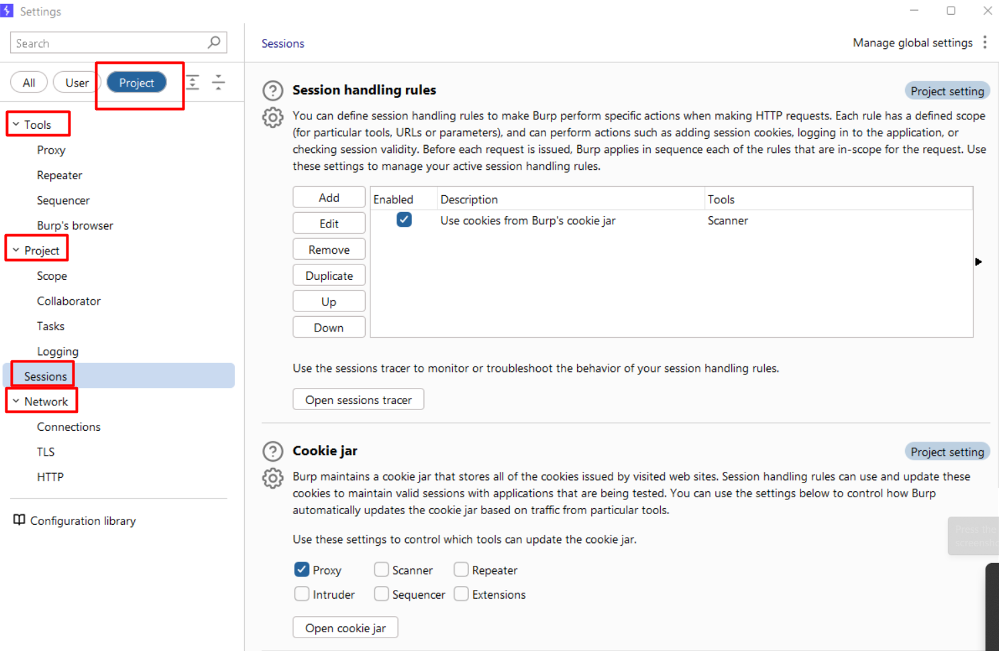

Project settings cho phép lưu hoặc thiết lập cấu hình cụ thể cho dự án hoặc mục tiêu trong Burp Suite. Các cài đặt này bao gồm Tools, Projects, Session và Network, rất cần thiết cho việc đánh giá các mục tiêu cụ thể của pentesters.
### Cách tìm chức năng Setting Project
- Đầu tiên bấm vào nút `Settings` ở phía bên phải giao diện BurpSuite

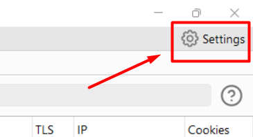

- Tiếp theo Burp sẽ hiện thị cửa sổ mới và hiện lên giao diện Settings

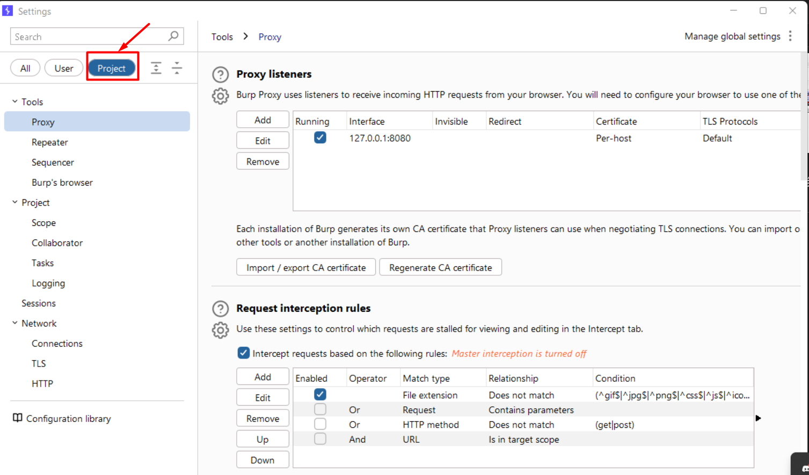

- Nó các tab nhỏ chính bên trong như Tools, Project, Sessions, and Network

#### The Project | Tools tab
Tab này cho phép bạn thiết lập cấu hình cho các công cụ Proxy, Repeater, Sequencer và trình duyệt của Burp Suite

##### The Project | Tools | Proxy tab
- Trong tab con Proxy có các phần như:
  - Proxy listeners: Mặc định, Burp Suite cấu hình một proxy listener cho localhost của bạn chạy trên cổng 8080. Các proxy listener khác có thể được cấu hình trong khu vực này để kiểm thử các ứng dụng không bình thường, chẳng hạn như ứng dụng di động.
  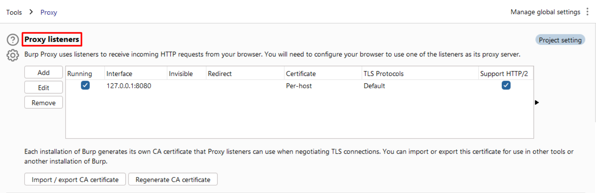

  - Request interception rules: Quy tắc chặn: Mặc định, Burp Suite Proxy được cấu hình để lắng nghe và chặn tất cả các yêu cầu HTTP ngoại trừ hình ảnh (^gif$, ^jpg$, ^png$, ^css$, ^js$, ^ico$, ^svg$, ^eot$, ^woff$, ^woff2$, và ^ttf$). Nếu bạn muốn thay đổi cài đặt mặc định, bạn có thể thực hiện tại đây.
  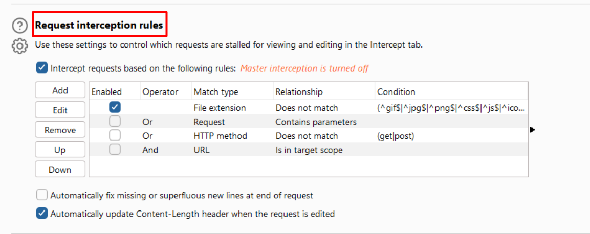

  - Response interception rules: Lợi ích của việc chặn phản hồi là bạn có thể thao tác các mã trạng thái và nội dung phản hồi để xác định xem JavaScript trên trang web có phản ứng khác nhau dựa trên những thay đổi đó hay không.
  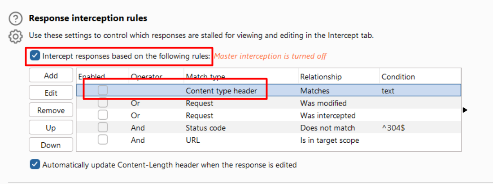

  - WebSocket interception rules: Khi một ứng dụng sử dụng WebSockets, cài đặt này kiểm soát việc chặn các thông điệp được truyền qua WebSockets.
  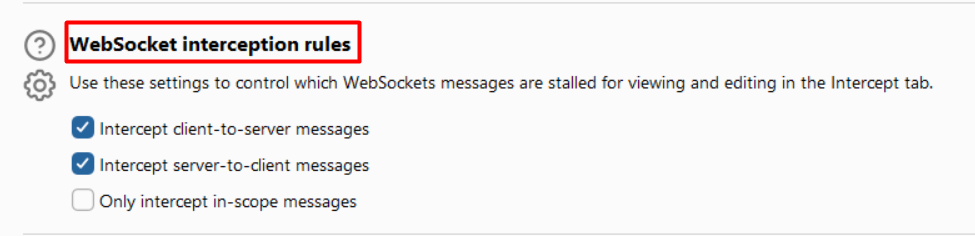
  
  - Response modification rules: Burp Suite cho phép chỉnh sửa lại phản hồi HTML trước khi chuyển tiếp đến trình duyệt cục bộ. Trong phần này, có thể cấu hình Burp Suite để hiện các trường biểu mẫu bị ẩn hoặc vô hiệu hóa JavaScript trên trang phản hồi.
  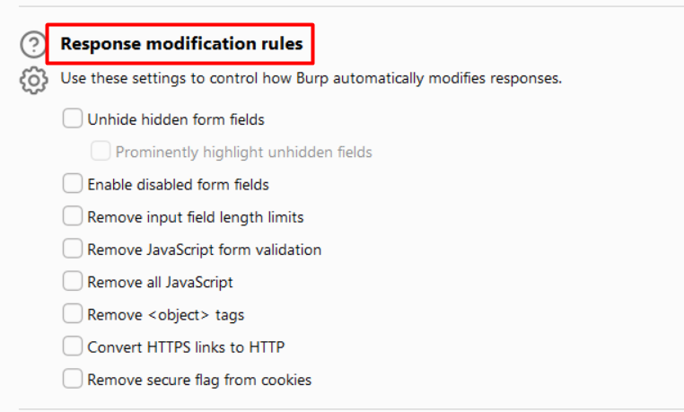
  
  - Match and replace rules: bảng quy tắc Match and Replace cho phép tự động thay thế các giá trị trong yêu cầu hoặc phản hồi trước khi chặn. Việc sử dụng bảng này tùy thuộc vào người kiểm thử. Ví dụ, bảng này có thể được dùng để thay thế user agent để trình duyệt trông như trên điện thoại di động, thiết lập giá trị cookie hoặc thậm chí loại bỏ các header. Cũng có thể thêm quy tắc biểu thức chính quy để khớp các giá trị.
  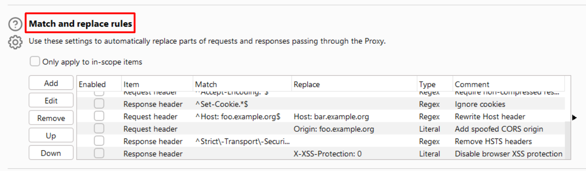
  
  - TLS pass through: TLS pass-through có thể được sử dụng để nhận diện đích đến khi có các thiết bị khác nằm trước mục tiêu. Burp Suite sẽ truyền lưu lượng qua các thiết bị đó và chỉ tìm đến mục tiêu được xác định.
  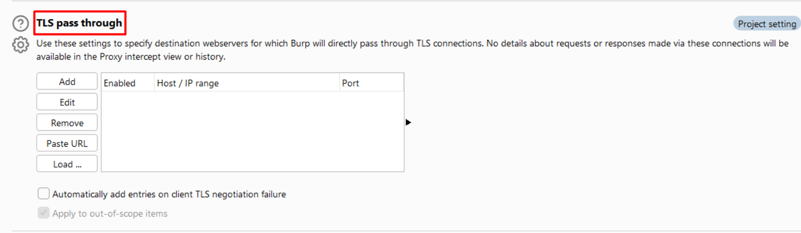
  
  - Miscellaneous: Khu vực tổng quát cho hành vi của Burp Suite Proxy nằm trong phần Miscellaneous. Khu vực này cho phép thay đổi giao thức HTTP được sử dụng sang phiên bản rất cũ, HTTP/1.0. Khu vực này cũng cho phép kiểm soát giải nén gzip.
  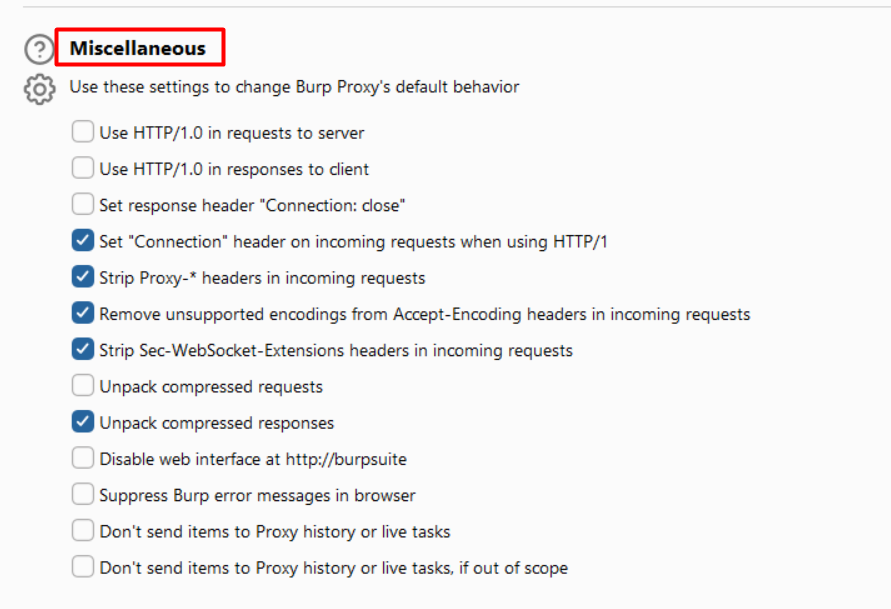

##### The Project | Tools | Repeater tab
  - Connections: Thiết lập này kiểm soát việc Repeater có tái sử dụng cùng một kết nối và giao thức được sử dụng trong yêu cầu ban đầu hay để Burp Suite tạo một kết nối mới và thay đổi giao thức.
  
  - Message modification: Mọi thay đổi được thực hiện trong phần này chỉ được lưu vào dự án hiện tại.

  - Redirects: Khi sử dụng Burp Suite Repeater, bất cứ khi nào gặp 302 Redirect, có thể kiểm soát hành vi của Repeater trong phần này. Đối với hầu hết các người thử nghiệm, họ chọn không thực hiện chuyển hướng tự động, nên thiết lập mặc định thường là đủ. 

  - Default tab group: Trừ khi đang thực hiện các cuộc tấn công client-desync với nhiều nhóm tab, thường không cần thay đổi thiết lập này. Khu vực này cho phép chỉ định nhóm tab mà bất kỳ yêu cầu mới nào gửi đến Repeater sẽ được chuyển đến.


##### The Project | Tools | Sequencer tab
  - Live capture: Thiết lập này kiểm soát số lượng luồng và hành vi mà Sequencer sẽ sử dụng khi thu thập token từ các yêu cầu trực tiếp. Đối với hầu hết các người thử nghiệm, cấu hình mặc định là đủ.

  - Token handling: Thiết lập này kiểm soát cách mỗi token thu thập được xử lý trong quá trình phân tích. Đối với hầu hết các người thử nghiệm, cấu hình mặc định là đủ.

  - Token analysis: Thiết lập này kiểm soát các loại kiểm tra được thực hiện đối với token. Đối với hầu hết các người thử nghiệm, cấu hình mặc định là đủ.


##### The Project | Tools | Burp’s browser tab
  - Thiết lập này kiểm soát trình duyệt Chromium tích hợp của Burp và cho phép sử dụng GPU của máy. Cũng có thể cấu hình trình duyệt tích hợp chạy mà không có sandbox. Chế độ sandbox là cơ chế bảo vệ nhằm ngăn các ứng dụng bị tấn công ảnh hưởng đến máy tính cục bộ. Đối với hầu hết các người thử nghiệm, cấu hình mặc định là đủ.

##### The Project | Project | Scope tab
  - Target scope: Xác định các URL và tài nguyên mà người thử nghiệm muốn tập trung hoặc loại trừ vào trong quá trình kiểm tra bảo mật.

  - Out-of-scope request handling: Khi được kích hoạt, sẽ khiến Burp Suite loại bỏ bất kỳ yêu cầu nào không nằm trong phạm vi, ngay cả khi được gửi từ trình duyệt. Đối với hầu hết các người thử nghiệm, cấu hình mặc định là đủ.

##### The Project | Project | Collaborator tab

  - Burp Suite Collaborator là một tính năng của Burp Suite Professional, cung cấp cho người thử nghiệm quyền truy cập vào một máy chủ bên ngoài để thu thập các yêu cầu DNS và/hoặc HTTP được thực hiện bởi các máy chủ mục tiêu nội bộ. Đây là một tính năng rất mạnh mẽ cho kẻ tấn công vì nhiều lỗ hổng có thể được chứng minh bằng cách sử dụng Collaborator. Các lỗ hổng như giả mạo yêu cầu từ phía máy chủ (SSRF), rò rỉ dữ liệu qua kịch bản chéo (XSS), đánh cắp cookie và nhiều hơn nữa. Hầu hết người thử nghiệm sử dụng máy chủ Collaborator do PortSwigger cung cấp, nhưng cũng có thể cấu hình máy chủ riêng trong thiết lập này và sử dụng thay thế. (Chap11 chi tiết hơn về phần này)

  - Phần này có một nút để chạy kiểm tra tình trạng. Nhấn vào Run health check cho phép kiểm tra kết nối với tất cả các dịch vụ bên ngoài được cung cấp trên máy chủ Collaborator bên ngoài.

##### The Project | Project | Tasks tab

  - Resource pools: Pools tài nguyên là các luồng có sẵn cho các tác vụ tấn công và quét. Thiết lập này cho phép tạo các pools tài nguyên tùy chỉnh với số lượng yêu cầu đồng thời (luồng) thấp hơn và điều chỉnh thời gian gửi yêu cầu. Việc sử dụng thiết lập mặc định hoàn toàn phụ thuộc vào khả năng của ứng dụng mục tiêu trong việc xử lý nhiều yêu cầu cùng lúc. Nếu chưa chắc chắn, nên tạo một pool tài nguyên tùy chỉnh với ít hơn 10 yêu cầu đồng thời.
  
  - New task auto-start: Các tác vụ là các lần quét tự động có thể chạy trong nền. Thiết lập này cho phép cấu hình để các tác vụ tự động khởi động ngay khi được tạo. Đối với hầu hết các người thử nghiệm, cấu hình mặc định là đủ.

  - Schedule tasks: Nếu muốn lên lịch cho các tác vụ, thiết lập này cho phép đặt ngày, giờ và tần suất để các tác vụ cụ thể bắt đầu và dừng.

##### The Project | Project | Logging tab

  - Tab Logging cho phép chỉ định công cụ nào sẽ ghi lại các yêu cầu và/hoặc phản hồi vào một tệp. Nếu được chọn, người dùng sẽ được nhắc chọn tên tệp và vị trí lưu tệp nhật ký trên máy cục bộ.

#### The Project | Sessions tab
Xem Chương 10 để biết thêm hướng dẫn về cách sử dụng các chức năng trong tab Sessions. Tab Sessions bao gồm các khu vực Session handling rules, Cookie jar và Macros.

- Trong tab Sessions, người thử nghiệm có các tùy chọn sau:

  - Session handling rules: Khu vực này cho phép cấu hình các quy tắc xử lý phiên tùy chỉnh khi đánh giá một ứng dụng web. Theo mặc định, Burp Suite thu thập và sử dụng tất cả cookie được thấy trong lưu lượng HTTP và lưu chúng trong khu vực Cookie jar.

  - Cookie jar: Cung cấp danh sách các cookie, cùng với tên miền, đường dẫn và cặp tên/giá trị mà Burp Suite Proxy đã thu thập (theo mặc định). Các cookie trong khu vực Cookie jar cũng có thể chỉnh sửa được.

  - Macros: Khu vực Macros cho phép người thử nghiệm viết kịch bản cho các yêu cầu/phản hồi đã thực hiện trước đó nhằm tự động hóa các hoạt động khi tương tác với ứng dụng mục tiêu.

#### The Project | Network tab

- Tab Network cung cấp các điều khiển cho các khu vực Connections, TLS và HTTP.

##### The Project | Network | Connections tab

- Tab Connections: Tab này cho phép người thử nghiệm kiểm soát các tương tác cụ thể như xác thực và máy chủ proxy:

  - Platform authentication cho phép tự động hóa cách Burp Suite xác thực với các nền tảng mục tiêu. Thiết lập mặc định của tính năng này ở mức người dùng.

    - Nếu muốn đặt ở mức dự án, cần sử dụng thanh trượt bên trái để kích hoạt tùy chọn Override chỉ cho dự án này.

    - Sau khi chọn ô Add, một bảng các tùy chọn xác thực (như Basic, NTLMv2, hoặc NTLMv1) sẽ hiện ra để sử dụng với nền tảng mục tiêu. Máy chủ đích thường được đặt là ký tự đại diện (*), và thông tin đăng nhập cùng tên miền cần được biết trước.

    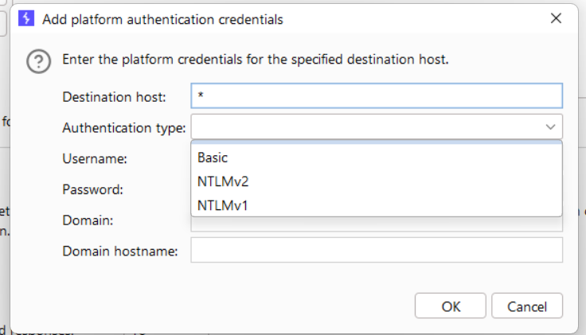

    - Khu vực Timeouts cho phép đặt ngưỡng thời gian chờ khi Burp Suite cố gắng kết nối với các ứng dụng mục tiêu. Đối với hầu hết các người thử nghiệm, cấu hình mặc định là đủ.

    - Thiết lập Upstream proxy servers cho phép xác định các máy chủ proxy ngược dòng để truy cập ứng dụng mục tiêu. Thiết lập mặc định của tính năng này ở mức người dùng.

    - Sau khi chọn ô để ghi đè các tùy chọn của người dùng, một bảng sẽ xuất hiện để kích hoạt các tùy chọn proxy ngược dòng cụ thể cho dự án này. Nhấp vào nút Add sẽ hiển thị một hộp thoại có tên Add upstream proxy rule. Quy tắc này là riêng cho môi trường của ứng dụng mục tiêu. Tính năng này rất hữu ích nếu môi trường của ứng dụng mục tiêu được đặt phía trước một web proxy yêu cầu thông tin đăng nhập khác với đăng nhập của ứng dụng.

    - Hostname resolution overrides cho phép thêm các mục host tương tự như tệp host trên máy cục bộ để ghi đè quá trình phân giải Hệ thống Tên Miền (DNS).

    - SOCKS proxy cho phép Burp Suite truy cập mục tiêu thông qua cấu hình proxy SOCKS. Thiết lập mặc định của tính năng này ở mức người dùng.